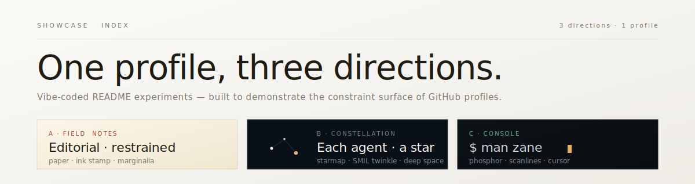

  

&nbsp;

# Zane Wang

I build useful systems for fuzzy problems &mdash; agents that remember,
maps that explain, tools that remove friction, and prototypes with
enough personality to make the demo worth finishing.

> This profile is currently a **showcase repo**. Three different
> README directions live under `previews/`, each a complete take on
> the same content. Pick one to read, or read all three to see the
> trade-offs.

&nbsp;

## The three directions

<table>
<tr>
<td width="33%" valign="top">

### [A &mdash; Field Notes](./previews/field-notes/)

Editorial · restrained · scientific

A naturalist's research journal. Paper, ink stamp, marginalia gutter.
Slow, considered, asymmetric.

*Best if you want this profile to feel like it was edited by hand.*

[Read the preview &rarr;](./previews/field-notes/)

</td>
<td width="33%" valign="top">

### [B &mdash; Constellation](./previews/constellation/) ⭐

Each agent is a star. The constellation does the work.

A dark-sky starmap with named stars for projects and agents. Subtle
SMIL twinkle. Anchored navigation by Greek letter.

*Best if you want the brand to do the talking.*

[Read the preview &rarr;](./previews/constellation/)

</td>
<td width="33%" valign="top">

### [C &mdash; Console](./previews/console/)

`$ man zane`

Refined PROD-radar terminal. Dim phosphor green, single amber accent,
blinking cursor. `man page` documentation per project.

*Best if you want the medium to be the message.*

[Read the preview &rarr;](./previews/console/)

</td>
</tr>
</table>

&nbsp;

---

## Why a showcase

A GitHub README has unusually tight constraints &mdash; no JavaScript, no full
CSS, no real interactivity, an HTML sanitizer that strips most of what you'd
reach for elsewhere. Working inside those constraints is its own design
discipline.

This repo experiments with three opinionated takes, all built from the same
content and all respecting the same constraints. The goal is to surface
what's actually possible &mdash; and what's not &mdash; so the next person
designing one of these has a reference, not a blank page.

The methodology is in [`~/.claude/skills/vibe-readme/SKILL.md`](https://github.com/zelinewang/zelinewang/blob/main/SKILL.md)
(coming soon as an open-source artifact). The lessons we collect from these
previews go into [`LEARNINGS.md`](./LEARNINGS.md).

&nbsp;

---

## Build quests

A few public projects worth a click.

[**`dev-orchestrator`**](https://github.com/zelinewang/dev-orchestrator) &nbsp;·&nbsp; one-command AI development lifecycle (`/dev` &rarr; investigate, plan, execute, verify, ship).

[**`claudemem`**](https://github.com/zelinewang/claudemem) &nbsp;·&nbsp; persistent searchable memory for AI agents.

[**`constellix`**](https://github.com/zelinewang/constellix) &nbsp;·&nbsp; multi-agent orchestration protocol.

[**`FireSight`**](https://github.com/zelinewang/FireSight) &nbsp;·&nbsp; wildfire intelligence layered on NASA satellite data.

[**`PulseConnect`**](https://github.com/zelinewang/PulseConnect) &nbsp;·&nbsp; computer-using AI outreach concept.

[**`santorini`**](https://github.com/zelinewang/santorini) &nbsp;·&nbsp; board-game logic; small rules, big systems thinking.

&nbsp;

---

## Working set

`Python` &nbsp;·&nbsp; `Go` &nbsp;·&nbsp; `TypeScript` &nbsp;·&nbsp; `JavaScript`
&nbsp;·&nbsp; `React` &nbsp;·&nbsp; `Node.js` &nbsp;·&nbsp; `Docker`
&nbsp;·&nbsp; `Linux` &nbsp;·&nbsp; `QGIS` &nbsp;·&nbsp; `Raspberry Pi`

&nbsp;

---

## Live signal

  <picture>
    <source media="(prefers-color-scheme: dark)" srcset="https://raw.githubusercontent.com/zelinewang/zelinewang/output/github-snake-dark.svg" />
    <source media="(prefers-color-scheme: light)" srcset="https://raw.githubusercontent.com/zelinewang/zelinewang/output/github-snake.svg" />
    
  </picture>

&nbsp;

---

**Want to ask something the FAQ doesn't cover?** &nbsp; The
[**ZaneOS Sidekick**](https://github.com/zelinewang/zelinewang/issues/new?title=ZaneOS%20ask%3A%20your%20question%20here&body=Replace%20the%20question%20in%20the%20title.%20A%20workflow%20with%20DeepSeek%20V4%20Flash%20will%20reply%20in%20this%20issue%20in%20about%2030%20seconds%20and%20close%20it.)
is a real AI bot (DeepSeek V4 Flash) that replies in a GitHub issue thread
in about 30 seconds. Per-user limit: 3 questions per 24h. Persona is in
[`ZANE_PERSONA.md`](./ZANE_PERSONA.md) — public on purpose.

[github](https://github.com/zelinewang) &nbsp;·&nbsp;
[linkedin](https://www.linkedin.com/in/zane-wang7/) &nbsp;·&nbsp;
[x](https://x.com/zanewang102)

