<!--
  Zane Wang's GitHub profile, as a single integrated mega-SVG.
  All design lives in assets/profile.svg (one composition, eight sections).
  Stats baked in nightly via .github/workflows/refresh-stats.yml.
  Snake fetched from output branch + spliced into §05.

  Why no <map>/<area> image-map? GitHub re-renders the  at container width
  while <area coords> are pixel-absolute — coords drift on different viewports
  and break entirely on mobile. So nav lives in the strip below as plain links.

  Two earlier directions (Field Notes, Constellation) are kept under
  previews/_drafts/ — same content, different aesthetic, not currently promoted.
-->

  

`§ 02 projects:`&nbsp;
[constellix](https://github.com/zelinewang/constellix) ·
[claudemem](https://github.com/zelinewang/claudemem) ·
[dev-orchestrator](https://github.com/zelinewang/dev-orchestrator) ·
[FireSight](https://github.com/zelinewang/FireSight) ·
[PulseConnect](https://github.com/zelinewang/PulseConnect) ·
[santorini](https://github.com/zelinewang/santorini)

`§ 03 fleet:`&nbsp;
[orchestrator overview](https://github.com/zelinewang/dev-orchestrator) — the same five agents the panel above lists, in real code

`§ 04 stats:`&nbsp;
live counts refreshed nightly via [refresh-stats.yml](./.github/workflows/refresh-stats.yml)
&nbsp;·&nbsp; [render-profile.mjs](./.github/scripts/render-profile.mjs)
&nbsp;·&nbsp; [console.svg.template](./.github/templates/console.svg.template)

`§ 05 trajectory:`&nbsp;
365-day contribution snake from [Platane/snk](https://github.com/Platane/snk), regenerated daily

`§ 08 sidekick:`&nbsp;
[ask the bot →](https://github.com/zelinewang/zelinewang/issues/new?title=ZaneOS%20ask%3A%20your%20question%20here&body=Replace%20the%20question%20in%20the%20title.%20A%20workflow%20with%20DeepSeek%20V4%20Flash%20will%20reply%20in%20this%20issue%20in%20about%2030%20seconds%20and%20close%20it.)

---

[github](https://github.com/zelinewang) &nbsp;·&nbsp;
[linkedin](https://www.linkedin.com/in/zane-wang7/) &nbsp;·&nbsp;
[x](https://x.com/zanewang102)

Methodology: [`vibe-readme/SKILL.md`](https://github.com/zelinewang/zelinewang/blob/main/SKILL.md) (coming soon as an open artifact).
Lessons: [`LEARNINGS.md`](./LEARNINGS.md). Two earlier directions kept under
[`previews/_drafts/`](./previews/_drafts/) — same content, different aesthetic.

