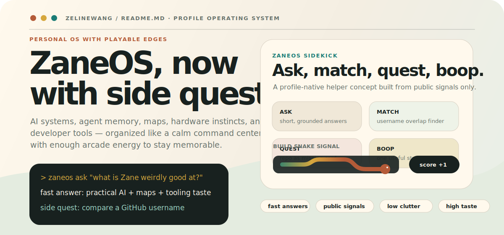
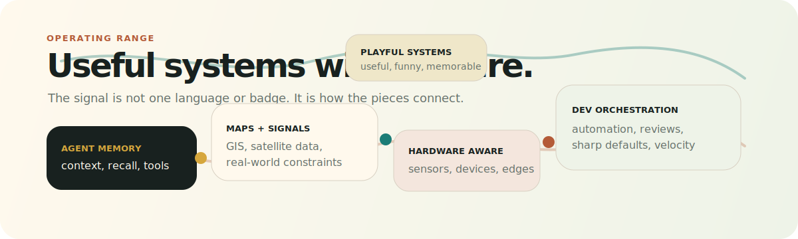

<p align="center">
  
</p>

<h1 align="center">Zane Wang</h1>

<p align="center">
  <strong>AI systems · agent memory · maps · hardware-aware software · developer tools · playful prototypes</strong>
</p>

<p align="center">
  I build useful systems for fuzzy problems: agents that remember, maps that explain,
  tools that remove friction, and prototypes with enough personality to make the demo worth finishing.
</p>

<p align="center">
  <a href="https://github.com/zelinewang">GitHub</a>
  ·
  <a href="https://www.linkedin.com/in/zane-wang7/">LinkedIn</a>
  ·
  <a href="https://x.com/zanewang102">X</a>
</p>

---

## ZaneOS Sidekick

`ZaneOS Sidekick` is the profile-native helper concept for this README: fast, public-signal-only, useful, and a little mischievous.

| Mode | Prompt | Output |
|---|---|---|
| `ask` | “What is Zane weirdly good at?” | A short answer grounded in public projects and visible build signals. |
| `match` | “Compare `@username` with Zane.” | Shared interests, complementary skills, and one fun collaboration angle. |
| `quest` | “Turn this repo into a mission card.” | A project summary with proof, flavor, and a reason to click. |
| `boop` | “Give me one useful strange idea.” | A tiny prototype pitch with enough personality to try. |

```text
zaneos ask "what should I talk to Zane about?"
zaneos match @octocat
zaneos quest dev-orchestrator
zaneos boop "maps + agents + hardware"
```

---

## Capability Map

<p align="center">
  
</p>

| Range | What it means |
|---|---|
| Agent memory | Persistent context, retrieval, tools, evaluation loops, and systems that keep moving when the problem gets messy. |
| Maps + signals | GIS, satellite data, environmental context, and interfaces that make real-world complexity easier to reason about. |
| Hardware-aware software | Code that respects sensors, devices, latency, failure modes, and the physical world outside the browser tab. |
| Dev orchestration | CLIs, automation, review loops, and workflow glue that makes builders noticeably faster. |
| Playful systems | Useful prototypes with story, motion, humor, and a small amount of suspicious charm. |

---

## Build Quests

| Quest | Public signal | Why it matters |
|---|---|---|
| [`dev-orchestrator`](https://github.com/zelinewang/dev-orchestrator) | One-command AI development lifecycle | Turns “please help” into investigate → plan → execute → verify → ship. |
| [`claudemem`](https://github.com/zelinewang/claudemem) | Persistent memory for agents | Keeps long-running engineering context searchable instead of evaporating. |
| [`FireSight`](https://github.com/zelinewang/FireSight) | Wildfire intelligence with NASA satellite data | Connects AI, maps, and real-world signals. |
| [`PulseConnect`](https://github.com/zelinewang/PulseConnect) | Computer-using AI outreach concept | Explores personalized workflows without turning the interface into a chore. |
| [`santorini`](https://github.com/zelinewang/santorini) | Board-game logic | Small rules, big systems thinking, clean interactions. |

---

## Working Set

`Python` · `Go` · `TypeScript` · `JavaScript` · `Java` · `C++` · `React` · `Node.js` · `Docker` · `Linux` · `QGIS` · `Raspberry Pi`

I care less about logo walls and more about tool fit: quick prototypes when the idea is unstable, durable systems when the shape is clear, and automation whenever the same task appears twice.

---

## Live Signals

<p align="center">
  
</p>

<p align="center">
  <picture>
    <source media="(prefers-color-scheme: dark)" srcset="https://raw.githubusercontent.com/zelinewang/zelinewang/output/github-snake-dark.svg" />
    <source media="(prefers-color-scheme: light)" srcset="https://raw.githubusercontent.com/zelinewang/zelinewang/output/github-snake.svg" />
    
  </picture>
</p>

<p align="center">
  <sub>No fragile top-language card here: if a widget returns errors, it does not get to steer the design.</sub>
</p>

---

## Good Conversation Starters

- Ask about agent memory, context, and how to make AI tools feel less forgetful.
- Bring a messy workflow; I will probably try to automate the boring part.
- Send a map, sensor stream, or strange dataset; I like systems with real-world texture.
- Pitch a tiny tool with personality. Useful and funny is the best combination.

<p align="center">
  <strong>Current mode:</strong> shipping practical AI systems, polishing weird edges, and keeping the signal high.
</p>
