<!--
  Canonical GitHub profile: Evidence Ledger / Professional.
  The hero is theme-aware presentation; every load-bearing claim, project link,
  principle, and contact path remains semantic Markdown for mobile readers,
  assistive technology, search, and resume-screening tools.
-->

<picture>
  <source media="(prefers-color-scheme: dark)" srcset="assets/hero-signal-dark.svg">
  <source media="(prefers-color-scheme: light)" srcset="assets/hero-signal.svg">
  
</picture>

**AI systems builder based in San Francisco.** My production background spans multimodal evaluation, high-volume data systems, workflow automation, and enterprise agents. My current public focus is the infrastructure underneath reliable agents: memory, delegation, and evidence-driven development.

[Explore the work ↓](#selected-work) · [LinkedIn](https://www.linkedin.com/in/zane-wang7/) · [GitHub](https://github.com/zelinewang)

## Current focus

I turn lessons from production AI systems into smaller, public, inspectable tools. The current thread is reliable agent execution across sessions and teams: durable context, bounded delegation, and workflows that keep evidence close to decisions.

**Current public proof:** [claudemem](https://github.com/zelinewang/claudemem) preserves context across coding-agent sessions, [handoff](https://github.com/zelinewang/handoff) measures when delegated execution helps and when coordination cost outweighs the benefit, and [dev-orchestrator](https://github.com/zelinewang/dev-orchestrator) keeps investigation, tests, verification, and shipping in one resumable workflow.

The product experiments below apply the same standard to computer use, real-time data, and deployment without presenting prototypes as production systems.

## Selected work

### Agent infrastructure

- **[claudemem](https://github.com/zelinewang/claudemem)** — persistent memory for coding agents, using portable Markdown records plus searchable indexing across sessions.
- **[handoff](https://github.com/zelinewang/handoff)** — a spec-and-ledger protocol for token-tiered delegation, published with its pre-registered evaluation and failure direction.
- **[dev-orchestrator](https://github.com/zelinewang/dev-orchestrator)** — an end-to-end development workflow that connects investigation, planning, tests, verification, shipping, hooks, and file-backed state.

### Product experiments

- **[PostPrism](https://github.com/zelinewang/postprism)** — a hackathon prototype with a front-end simulation and an experimental backend for parallel computer-use agents.
- **[FireSight](https://github.com/zelinewang/FireSight)** — a client-side wildfire map built around NASA FIRMS feeds and Leaflet.
- **[Dipole](https://github.com/zelinewang/dipole)** — a conversational deployment assistant for Netlify and Vercel with streamed progress and diagnostics.

## How I work

- **Prove before arguing.** A small experiment should be able to overturn the plan.
- **Fix the bottleneck.** Solve the constraint that changes the outcome; defer adjacent cleanup.
- **Keep evidence close to the claim.** Tests, source, logs, and failure cases beat polished confidence.
- **Leave leverage behind.** A delivery should make the next run easier to verify, resume, or reuse.

## Design studies

The canonical profile stays text-first. Three complete visual interpretations live in the [profile design gallery](./previews/): **Console**, **Constellation**, and **Field Notes**. They are design studies, not alternate claims.

## Contact

[LinkedIn](https://www.linkedin.com/in/zane-wang7/) · [GitHub](https://github.com/zelinewang) · [X](https://x.com/zanewang102)

<strong>Ask Zane's AI about the public work</strong>

The sidekick answers from this README, the public persona, and the six repositories above. It replies in a public GitHub issue and does not speak on Zane's behalf.

[Open a public question →](https://github.com/zelinewang/zelinewang/issues/new?title=ZaneOS%20ask%3A%20your%20question%20here&body=Replace%20the%20question%20in%20the%20title.%20Zane%27s%20AI%20will%20reply%20from%20the%20public%20profile%20context.)

