# Console

> Console · Complete profile design study

A dark terminal composition for the engineering-operator side of the same public work.

  

The visual is a dated, non-interactive artwork. Rows inside the SVG are not links. Use the public evidence paths below:

**Agent infrastructure:** [claudemem](https://github.com/zelinewang/claudemem) · [handoff](https://github.com/zelinewang/handoff) · [dev-orchestrator](https://github.com/zelinewang/dev-orchestrator)

**Product experiments:** [PostPrism](https://github.com/zelinewang/postprism) · [FireSight](https://github.com/zelinewang/FireSight) · [Dipole](https://github.com/zelinewang/dipole)

**Design rationale:** Dense evidence is organized as commands and gates; a single green signal carries the motion budget.

[Latest automated render](https://raw.githubusercontent.com/zelinewang/zelinewang/stats-output/studies/console.svg) · [All design studies](../README.md) · [Canonical profile](../../README.md)
