<p align="center">
  
</p>

&nbsp;

> *Each agent is a star. The constellation does the work.*

This is the **Constellation** preview of Zane Wang's profile —
one of three vibe-coded README directions explored in this repo.
([← back to the showcase index](../../README.md))

&nbsp;

## Navigate by star

```
α  constellix          β  claudemem        γ  dev-orchestrator
δ  FireSight           ε  PulseConnect     santorini
```

The fleet (smaller stars, bottom of map):
[Orion](#orion-the-planner) ·
[Nova](#nova-the-implementer) ·
[Sentinel](#sentinel-the-reviewer) ·
[Designer](#designer-the-eye) ·
[Maestro](#maestro-the-conductor)

&nbsp;

---

## Observation logs

> Open any star's log for what it does, why it exists, and the smallest useful version that shipped.

<details>
<summary><strong>α &nbsp; constellix</strong> &nbsp;·&nbsp; <em>the constellation — multi-agent orchestration protocol</em></summary>

&nbsp;

A multi-agent orchestration protocol where each agent has a specialized role
and the *constellation* of all of them — not any single one — does the work.

- **Designer** writes a visual spec; **Nova** implements; **Sentinel** audits
  with a different method; **Maestro** does the post-mortem.
- Two-phase Designer pipeline (spec → re-verify) catches bugs that three
  same-method reviewers miss.
- Documented in `~/.claude/skills/fleet/SKILL.md` and a public
  [`constellix`](https://github.com/zelinewang/constellix) repo with
  sanitized examples.

The name is the thesis. The thesis is the work.

</details>

<details>
<summary><strong>β &nbsp; claudemem</strong> &nbsp;·&nbsp; <em>the memory — persistent searchable memory for AI agents</em></summary>

&nbsp;

A SQLite-backed FTS5-indexed note + session store that survives compaction,
machine moves, and process restarts. Runs as a CLI; agents call it during
investigation and at session end.

- Hybrid search (FTS5 + semantic) when an embedding provider is configured;
  pure FTS5 when not.
- Bidirectional sync via union merge across machines.
- Observed at scale: ~570 notes, ~123 sessions across daily use.

Shipped because *agents that pretend to remember* lose more than they save.

</details>

<details>
<summary><strong>γ &nbsp; dev-orchestrator</strong> &nbsp;·&nbsp; <em>the protocol — one-command AI development lifecycle</em></summary>

&nbsp;

`/dev` is an end-to-end protocol: receive a task, classify type and tier,
investigate, brainstorm, plan, execute with TDD, verify, ship. Zero approval
checkpoints between phases — but explicit anomaly escalation when a decision
needs human judgment.

- Three task types (DEVELOP / RESEARCH / CICD) with phase adaptations per type.
- Three tiers (QUICK / STANDARD / DEEP) chosen from evidence, not keywords.
- Cross-session continuity via git log + claudemem (not self-reported state).
- Loop integration with `ScheduleWakeup` for CI waits, long builds, agent
  merges, and deploy health.

The brightest star on this map. Most of what I do passes through it.

</details>

<details>
<summary><strong>δ &nbsp; FireSight</strong> &nbsp;·&nbsp; <em>the eye — wildfire intelligence layered on NASA satellite data</em></summary>

&nbsp;

A hobby project that stitches NASA FIRMS satellite passes, weather feeds, and
a small classifier into a map view that explains *why* a hotspot looks the way
it does. Not a product — a way to keep AI, maps, and a real-world signal in
the same room.

</details>

<details>
<summary><strong>ε &nbsp; PulseConnect</strong> &nbsp;·&nbsp; <em>the outreach — computer-using AI outreach concept</em></summary>

&nbsp;

Exploration of personalized outreach that uses computer-use AI to research
and draft, but keeps a human in the approval loop. Built to feel less like a
spam tool and more like a deliberate assistant.

</details>

<details>
<summary><strong>santorini</strong> &nbsp;·&nbsp; <em>board-game logic — small rules, big systems thinking</em></summary>

&nbsp;

Implementation of the Santorini board game. Tiny ruleset on the surface, deep
strategic structure underneath. The right shape for practicing clean state
machines and turn validation.

</details>

&nbsp;

### The fleet (smaller stars)

<a id="orion-the-planner"></a>
<details>
<summary><strong>Orion</strong> &nbsp;·&nbsp; <em>the planner</em></summary>

Specialist agent for scope reduction. Receives absurd-scope tasks, returns
MVP slice candidates with explicit cuts and trade-offs. Routed first when a
task feels too big — saves Nova from building the wrong thing.
</details>

<a id="nova-the-implementer"></a>
<details>
<summary><strong>Nova</strong> &nbsp;·&nbsp; <em>the implementer</em></summary>

Specialist agent for execution. Reads the plan, runs `/dev --deep` internally,
ships the work. Bound by an explicit honest-disclosure rule: report intermediate
failures, not just final state.
</details>

<a id="sentinel-the-reviewer"></a>
<details>
<summary><strong>Sentinel</strong> &nbsp;·&nbsp; <em>the reviewer</em></summary>

Specialist agent for adversarial review. Forbidden from outcome-bias defaults
("LGTM") via a grep check on its own run-messages. Catches what Nova misses
because it audits with a different method.
</details>

<a id="designer-the-eye"></a>
<details>
<summary><strong>Designer</strong> &nbsp;·&nbsp; <em>the eye</em></summary>

Specialist agent for visual quality. Two-phase pipeline: writes a spec with
verification methods up front, then audits the build against computed-style
assertion (different from main session's screenshot pass).
</details>

<a id="maestro-the-conductor"></a>
<details>
<summary><strong>Maestro</strong> &nbsp;·&nbsp; <em>the conductor</em></summary>

Specialist agent for post-mortem. Writes the verdict as a separate process so
the same agent that built the slice cannot also score it. Anti-yes-man caps
keep verdicts from drifting up.
</details>

&nbsp;

---

## Working set

`Python` &nbsp;·&nbsp; `Go` &nbsp;·&nbsp; `TypeScript` &nbsp;·&nbsp; `JavaScript`
&nbsp;·&nbsp; `React` &nbsp;·&nbsp; `Node.js` &nbsp;·&nbsp; `Docker`
&nbsp;·&nbsp; `Linux` &nbsp;·&nbsp; `QGIS` &nbsp;·&nbsp; `Raspberry Pi`

I care about tool fit, not logo walls. Quick prototypes when the idea is
unstable; durable systems when the shape is clear; automation whenever the
same task appears twice.

&nbsp;

---

## Transmit a signal

Want to ask the constellation a question?
There's a sidekick on the main profile that replies in a GitHub issue thread.
30-second latency — call it the round-trip light delay.

[← Return to showcase index](../../README.md)
