# Dusk

> Dusk · Complete profile design study

A pixel-art sunset in the palette of the avatar next to it, over a city built from the past year of the contribution calendar: one building per week, one window per day, lit on days with contributions, and a gold pennant over each week in which one of the upstream pull requests below was merged. Under the city, the evidence itself: 12 pull requests merged into 10 upstream projects, set as a short list instead of a terminal listing.

**Production background:** AI evaluation, high-volume data systems, workflow automation, and enterprise agents. **Current public focus:** agent memory, bounded delegation, and evidence-driven development workflows.

  <picture>
    <source media="(max-width: 600px)" srcset="./assets/01-profile-phone.svg">
    
  </picture>

The visual is a dated, non-interactive artwork. Names inside the SVG are not links. Use the public evidence paths below:

**Merged upstream:** 12 pull requests in 10 projects, each linked in the [canonical profile](../../README.md).

**Agent infrastructure:** [claudemem](https://github.com/zelinewang/claudemem) · [handoff](https://github.com/zelinewang/handoff) · [dev-orchestrator](https://github.com/zelinewang/dev-orchestrator)

**Design rationale:** One picture and one piece of evidence, nothing the page already shows twice. The city is the contribution graph turned into an image, and its pennants tie the year to the pull requests listed under it: the same pennant marks each project in the list. The picture is drawn at the width GitHub shows it (846 px, and a second layout for phones below 600 px), so every art pixel lands on whole screen pixels. Fonts are embedded (Departure Mono for display, IBM Plex Mono for text, both SIL OFL). Motion is one load sequence, the city rising and its windows lighting up week by week; the evidence under it is static, so it can be read the moment the image loads.

[Latest automated render](https://raw.githubusercontent.com/zelinewang/zelinewang/stats-output/studies/dusk.svg) · [Phone layout](https://raw.githubusercontent.com/zelinewang/zelinewang/stats-output/studies/dusk-phone.svg) · [All design studies](../README.md) · [Canonical profile](../../README.md)
