<!--
  Field Notes preview v3 — single integrated mega-SVG per vibe-readme skill §0.1.
  Everything visual lives in 01-profile.svg as a 6-page bound notebook.
  Stats baked in via §0.2 pattern.
-->

  

`entries:`
[constellix](https://github.com/zelinewang/constellix) ·
[claudemem](https://github.com/zelinewang/claudemem) ·
[dev-orchestrator](https://github.com/zelinewang/dev-orchestrator) ·
[FireSight](https://github.com/zelinewang/FireSight) ·
[PulseConnect](https://github.com/zelinewang/PulseConnect) ·
[santorini](https://github.com/zelinewang/santorini)

`correspondence:`
[send a letter →](https://github.com/zelinewang/zelinewang/issues/new?title=ZaneOS%20ask%3A%20your%20question%20here&body=Replace%20the%20question%20in%20the%20title.%20A%20workflow%20with%20DeepSeek%20V4%20Flash%20will%20reply%20in%20this%20issue%20in%20about%2030%20seconds%20and%20close%20it.)

`Field Notes v3` is one of three vibe-coded directions explored in this repo. ([← back to showcase](../../README.md))
&nbsp;·&nbsp; [Console](../console/) &nbsp;·&nbsp; [Constellation](../constellation/)

