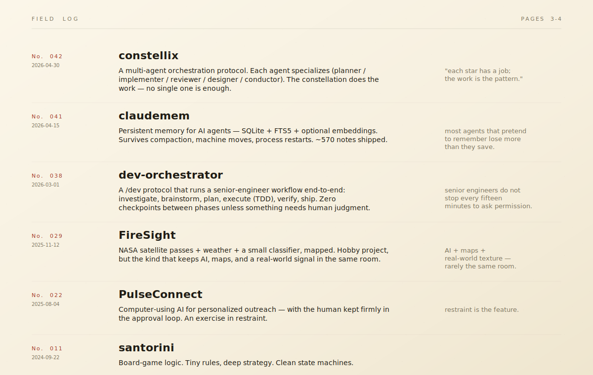
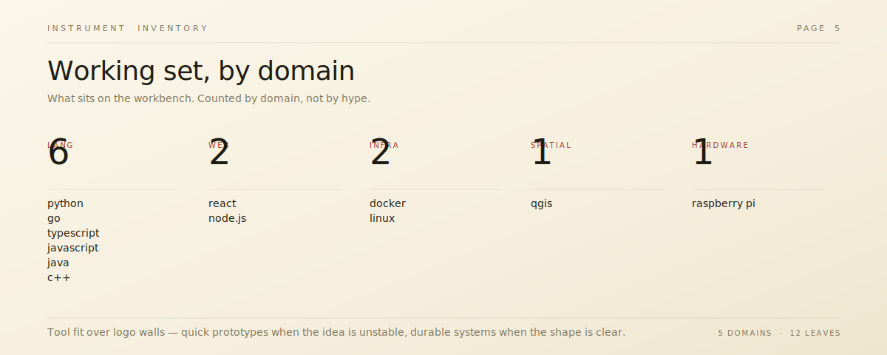
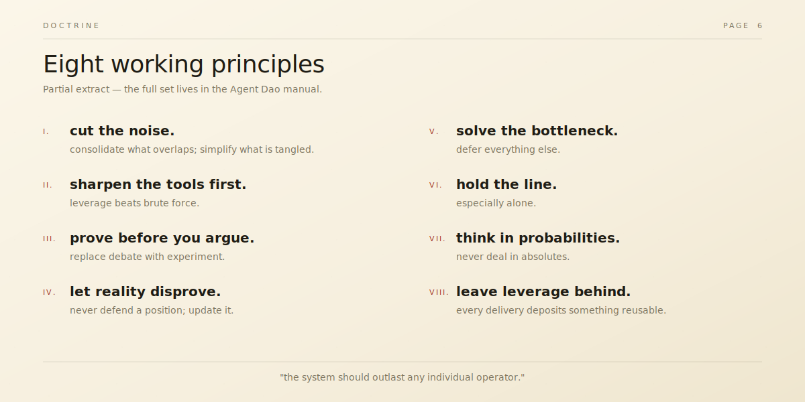
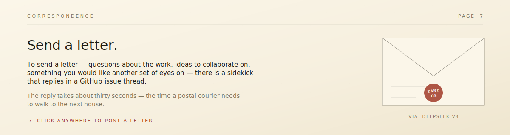

<!--
  Field Notes preview — SVG-driven profile per vibe-readme skill §0.
  Markdown is intentionally minimal: <picture>/ wrappers, anchor IDs,
  and clickable  wrappings. Everything visual lives in
  the SVG panels under ./assets/.
-->

  

&nbsp;

&nbsp;

  

&nbsp;

  

&nbsp;

&nbsp;

`Field Notes` is one of three vibe-coded directions explored in this repo.
[← back to the showcase index](../../README.md)
&nbsp;·&nbsp; [Console](../console/) &nbsp;·&nbsp; [Constellation](../constellation/)

