  

&nbsp;

This is the **Field Notes** preview of Zane Wang's profile —
one of three vibe-coded README directions explored in this repo.
([← back to the showcase index](../../README.md))

&nbsp;

## I am here to:

[&rarr; read about the work](#field-log) &nbsp;·&nbsp;
[&rarr; collaborate on something](#correspondence) &nbsp;·&nbsp;
[&rarr; consider hiring me](#disposition) &nbsp;·&nbsp;
[&rarr; just look around](#field-log)

&nbsp;

---

## §I &nbsp; Field log

> *Each entry is a project. The right column is what was learned in the doing —
> the kind of note one keeps in a margin to remind oneself.*

<table>
<tr>
<td width="65%" valign="top">

**No. 042 &nbsp;·&nbsp; 2026-04-30 &nbsp;·&nbsp; [`constellix`](https://github.com/zelinewang/constellix)**

A multi-agent orchestration protocol. Each agent specializes (planner /
implementer / reviewer / designer / conductor). The constellation does the
work — no single one is enough.

▸ [field notes (4)](#)

&nbsp;

**No. 041 &nbsp;·&nbsp; 2026-04-15 &nbsp;·&nbsp; [`claudemem`](https://github.com/zelinewang/claudemem)**

Persistent memory for AI agents — SQLite + FTS5 + optional embeddings.
Survives compaction, machine moves, process restarts. Now at ~570 notes
across daily use.

▸ [field notes (3)](#)

&nbsp;

**No. 038 &nbsp;·&nbsp; 2026-03-01 &nbsp;·&nbsp; [`dev-orchestrator`](https://github.com/zelinewang/dev-orchestrator)**

A `/dev` protocol that runs a senior-engineer workflow end-to-end:
investigate, brainstorm, plan, execute with TDD, verify, ship. Zero
checkpoints between phases unless something needs human judgment.

▸ [field notes (5)](#)

&nbsp;

**No. 029 &nbsp;·&nbsp; 2025-11-12 &nbsp;·&nbsp; [`FireSight`](https://github.com/zelinewang/FireSight)**

NASA satellite passes + weather + a small classifier, mapped. Hobby project,
but the kind that keeps AI, maps, and a real-world signal in the same room.

▸ [field notes (2)](#)

&nbsp;

**No. 022 &nbsp;·&nbsp; 2025-08-04 &nbsp;·&nbsp; [`PulseConnect`](https://github.com/zelinewang/PulseConnect)**

Computer-using AI for personalized outreach — with the human kept firmly in
the approval loop. An exercise in restraint.

▸ [field notes (1)](#)

&nbsp;

**No. 011 &nbsp;·&nbsp; 2024-09-22 &nbsp;·&nbsp; [`santorini`](https://github.com/zelinewang/santorini)**

Board game logic. Tiny rules, deep strategy — the right shape for practicing
clean state machines.

</td>
<td width="35%" valign="top" style="padding-left: 24px;">

> &nbsp;
> *"Each star has a job; the work is the pattern."*
> &nbsp;
> &nbsp;
> ─────
> &nbsp;
> &nbsp;
> *Most agents that pretend to remember lose more than they save. claudemem is the antidote.*
> &nbsp;
> &nbsp;
> ─────
> &nbsp;
> &nbsp;
> *Senior engineers do not stop every fifteen minutes to ask permission.*
> &nbsp;
> *They escalate when escalation is the right answer.*
> &nbsp;
> &nbsp;
> ─────
> &nbsp;
> &nbsp;
> *AI + maps + real-world texture — three rooms; rarely the same room.*
> &nbsp;
> &nbsp;
> ─────
> &nbsp;
> &nbsp;
> *Restraint is the feature.*

</td>
</tr>
</table>

&nbsp;

---

## §II &nbsp; Working set

`Python` &nbsp;·&nbsp; `Go` &nbsp;·&nbsp; `TypeScript` &nbsp;·&nbsp; `JavaScript`
&nbsp;·&nbsp; `React` &nbsp;·&nbsp; `Node.js` &nbsp;·&nbsp; `Docker`
&nbsp;·&nbsp; `Linux` &nbsp;·&nbsp; `QGIS` &nbsp;·&nbsp; `Raspberry Pi`

I care about tool fit. Quick prototypes when the idea is unstable; durable
systems when the shape is clear; automation when the same task appears twice.

&nbsp;

---

## §III &nbsp; Disposition

I lean toward problems with real-world texture: agent systems that have to
remember something, maps that have to explain something, hardware that has to
respond to something. Less interested in pure software puzzles, more
interested in systems that touch the world somewhere.

I work well with people who write things down, who push back when they have
evidence, and who trust that good defaults compound.

&nbsp;

---

## §IV &nbsp; Correspondence

To send a letter — questions about the work, ideas to collaborate on, or
something you'd like another set of eyes on — there is a sidekick on the
[main profile](../../README.md) that replies in a GitHub issue thread.

The reply takes about thirty seconds. Think of it as the time a postal courier
needs to walk to the next house.

[← Return to showcase index](../../README.md)
