# Sunset

> Sunset · Complete profile design study

The same terminal session as Console, opened with a login banner: a pixel-art sunset in the palette of the avatar next to it, over a skyline drawn from the contribution calendar. Each building is one week, each window one day, lit on days with contributions; a taller building is a busier week.

**Production background:** AI evaluation, high-volume data systems, workflow automation, and enterprise agents. **Current public focus:** agent memory, bounded delegation, and evidence-driven development workflows.

  

The visual is a dated, non-interactive artwork. Rows inside the SVG are not links. Use the public evidence paths below:

**Merged upstream:** 12 pull requests in 10 projects, each linked in the [canonical profile](../../README.md).

**Agent infrastructure:** [claudemem](https://github.com/zelinewang/claudemem) · [handoff](https://github.com/zelinewang/handoff) · [dev-orchestrator](https://github.com/zelinewang/dev-orchestrator)

**Design rationale:** The contribution graph becomes the image instead of a statistic next to it. Fonts are embedded (Departure Mono for display, IBM Plex Mono for text, both SIL OFL) so the card renders the same on every system; motion is one load sequence, buildings rising and windows lighting up week by week.

[Latest automated render](https://raw.githubusercontent.com/zelinewang/zelinewang/stats-output/studies/sunset.svg) · [All design studies](../README.md) · [Canonical profile](../../README.md)
